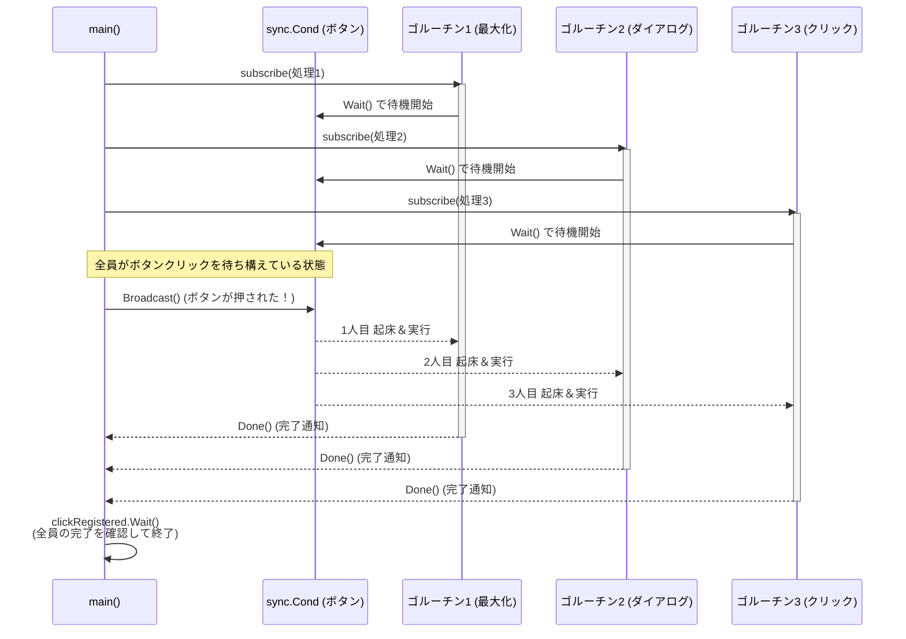

## 1. sync.Cond の `Broadcast()`（一斉通知）
前回の `Signal()` が「待機中のゴルーチンを1つだけ起こす」のに対し、**`Broadcast()` は「待機中の全てのゴルーチンを一斉に起こす」** メソッドです。
これを使うと、1つのイベント（例：ボタンのクリック、システムのシャットダウンなど）をトリガーにして、複数の処理を同時にスタートさせる「イベント購読（Pub/Sub）モデル」のような動きを作ることができます。

## 2. 実装例（ボタンクリックのイベント通知）
以下のコードは、GUIのボタン（`Button`）がクリックされたときに、登録しておいた複数の処理（ウィンドウの最大化、ダイアログの表示など）が一斉に走る仕組みをシミュレートしています。

```go
package main

import (
	"fmt"
	"sync"
)

func main() {
	// 1. イベント用の条件変数を持つボタンを定義
	type Button struct {
		Clicked *sync.Cond
	}
	button := Button{
		Clicked: sync.NewCond(&sync.Mutex{}),
	}

	// 2. イベントを「購読（Subscribe）」する関数
	subscribe := func(c *sync.Cond, fn func()) {
		var goroutineRunning sync.WaitGroup
		goroutineRunning.Add(1)
		
		go func() {
			goroutineRunning.Done() // ゴルーチンが確実に起動したことを報告
			
			c.L.Lock()
			defer c.L.Unlock()
			c.Wait() // クリックされるまで待機（ブロック）
			fn()     // クリックされたら登録した処理を実行
		}()
		
		// ⚠️ ゴルーチンがちゃんと起動するまでメイン側はここで待つ
		goroutineRunning.Wait()
	}

	// 3. 実行したい処理を3つ登録する
	var clickRegistered sync.WaitGroup
	clickRegistered.Add(3)
	
	subscribe(button.Clicked, func() {
		fmt.Println("Maximizing window")
		clickRegistered.Done()
	})
	subscribe(button.Clicked, func() {
		fmt.Println("Displaying annoying dialog!")
		clickRegistered.Done()
	})
	subscribe(button.Clicked, func() {
		fmt.Println("Mouse clicked")
		clickRegistered.Done()
	})

	// 4. ボタンをクリックし、待機中の3人を【一斉に】起こす！
	button.Clicked.Broadcast()
	
	// 5. 全員の処理が終わるのを待つ
	clickRegistered.Wait()
}
```

## 3. このコードの重要なポイント

### ① `Broadcast()` による一斉通知
最後に `button.Clicked.Broadcast()` が呼ばれると、`subscribe` 内の `c.Wait()` で眠っていた3つのゴルーチンが一斉に目を覚まします。
それぞれがカギ（Lock）を取り直して順番に `fn()` を実行するため、安全に3つの別々の処理が並行して走ります。

### ② `subscribe` 内での WaitGroup（`goroutineRunning`）の工夫
`subscribe` 関数の中で、わざわざ `goroutineRunning` という `WaitGroup` を作って待機しています。
これは、**「ゴルーチンが確実に起動して `Wait()` の準備に入る前に、メインプログラムがどんどん先に進んで `Broadcast()` を発動してしまうのを防ぐため」**の工夫です。
Goのチャネルなどとは違い、`sync.Cond` の通知（SignalやBroadcast）は**「誰も聞いていなかったらそのまま消えて無くなる（空振りする）」**という性質があります。そのため、購読者がちゃんと待ち構える状態になるまで待ってあげることで、空振りを防いでいます。

## 4. 処理の流れ（シーケンス図）
`subscribe` で複数の処理が待機状態に入り、`Broadcast()` で一斉に目を覚まして実行されるまでの流れです。


