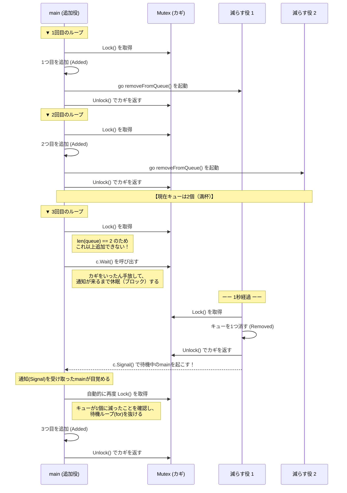

## 1. sync.Cond（条件変数）
`sync.Cond` は、ゴルーチン間で「特定の条件が満たされるまで待機する」および「条件が満たされたことを通知する」ための仕組みです。
単純な `sync.Mutex` だけでは難しい「キューが空になるまで待つ」「バッファがいっぱいになったら待つ」といった複雑な状態待ち（プロデューサー・コンシューマーパターンなど）を効率的に実装できます。

### 重要なメソッド
- **`sync.NewCond(&sync.Mutex{})`**: Mutex（カギ）と紐付いた条件変数を作成します。
- **`c.Wait()`**: カギをいったん手放して（Unlock）、他の誰かから通知が来るまでゴルーチンを休眠（ブロック）させます。通知を受け取って目覚めると、自動的にカギを取り直し（Lock）てから次の行へ進みます。
- **`c.Signal()`**: `Wait()` で待機しているゴルーチンのうち、**1つだけ**を起こして通知します。
- **`c.Broadcast()`** (今回は未使用): `Wait()` で待機している**全て**のゴルーチンを一斉に起こして通知します。

---

## 2. 実装例（最大2個まで入るキューの制御）
以下のコードは、キューの最大長を `2` に制限し、満杯になったら追加を一時停止（`Wait`）し、別のゴルーチンが要素を減らして通知（`Signal`）してきたら追加を再開するプログラムです。

```go
package main

import (
	"fmt"
	"sync"
	"time"
)

func main() {
	// Mutexと紐付いた条件変数(Cond)を作成
	c := sync.NewCond(&sync.Mutex{})
	queue := make([]interface{}, 0, 10)

	// キューから要素を減らして、待っている人に通知する関数
	removeFromQueue := func(delay time.Duration) {
		time.Sleep(delay)
		c.L.Lock()
		queue = queue[1:]
		fmt.Println("Removed from queue")
		c.L.Unlock()
		c.Signal() // 待機しているゴルーチンを1つ起こす
	}

	for i := 0; i < 10; i++ {
		c.L.Lock()
		
		// ⚠️ 重要: 条件のチェックは必ず for ループで行う
		for len(queue) == 2 {
			c.Wait() // キューが満杯(2個)なら、カギを手放して寝て待つ
		}
		
		fmt.Println("Added to queue")
		queue = append(queue, struct{}{})
		go removeFromQueue(time.Second) // 1秒後に減らす処理を裏で走らせる
		
		c.L.Unlock()
	}
}
```

### ⚠️ `for` ループで条件をチェックする理由
`Wait()` から目覚めた直後、自分がカギを取り直すほんのわずかな隙に、他のゴルーチンが状態を変えてしまっている（今回で言えば、別の誰かが先に追加して再び満杯になっている）可能性があります。そのため、`if` ではなく `for` を使って「目覚めた後も本当に条件を満たしているか」を必ず再確認するのが `sync.Cond` の絶対ルールです。

---

## 3. 処理の流れ（シーケンス図）
キューが満杯になり、`Wait()` で待機してから `Signal()` で再開するまでの流れです。



---

## 4. 文法に関するQ&A（Tips）

### Q1. `&sync.Mutex{}` ってどういう意味？
**A.** 「新しく `sync.Mutex` の実体を作り、そのポインタ（メモリアドレス）を取得する」という書き方です。
`sync.NewCond()` には、コピーされたカギではなく「大元のカギ（ポインタ）」を渡す必要があるため、`&` をつけてポインタとして渡しています。
（`ptr := new(sync.Mutex)` と書くのと同じ意味になります）

### Q2. `make([]interface{}, 0, 10)` の「10」って何？
**A.** スライスの**容量（Capacity）**です。
最初は空っぽ（長さ0）でスタートしますが、あらかじめ「10個分の枠」を裏側で確保しておきます。これによって、10個まではデータ追加時のメモリの再確保（引っ越し作業）が発生しなくなり、パフォーマンスが良くなります。
（※ちなみに、10個を超えても自動的に容量が拡張されるため、エラーにはならず無制限に追加できます）

### Q3. `queue = queue[1:]` とはどういう意味？
**A.** スライスの**先頭の要素を1つ削除する**ための定番の書き方です。
インデックス `1`（2番目の要素）から一番最後までを切り取って新しいスライスを作り、元の変数に上書きすることで、0番目の要素を取り除いています。これにより、「先に入ったものから順番に処理されて消えていく」というキュー（待ち行列）の動きを再現しています。

### Q4. `c.L.Unlock()` は `defer` を使ったほうが良いのでは？
**A.** おっしゃる通りです！**実務では `defer c.L.Unlock()` を使うのが最も安全なベストプラクティス**です。
```go
c.L.Lock()
defer c.L.Unlock()
```
このように書くことで、途中でパニック（エラー）が起きた場合でも確実にカギが返却され、デッドロックを防ぐことができます。
なお、`defer` を使うと「カギを持ったまま `c.Signal()` で人を起こす」ことになりますが、Goの仕様としてカギを持ったまま通知しても全く問題ありません。
