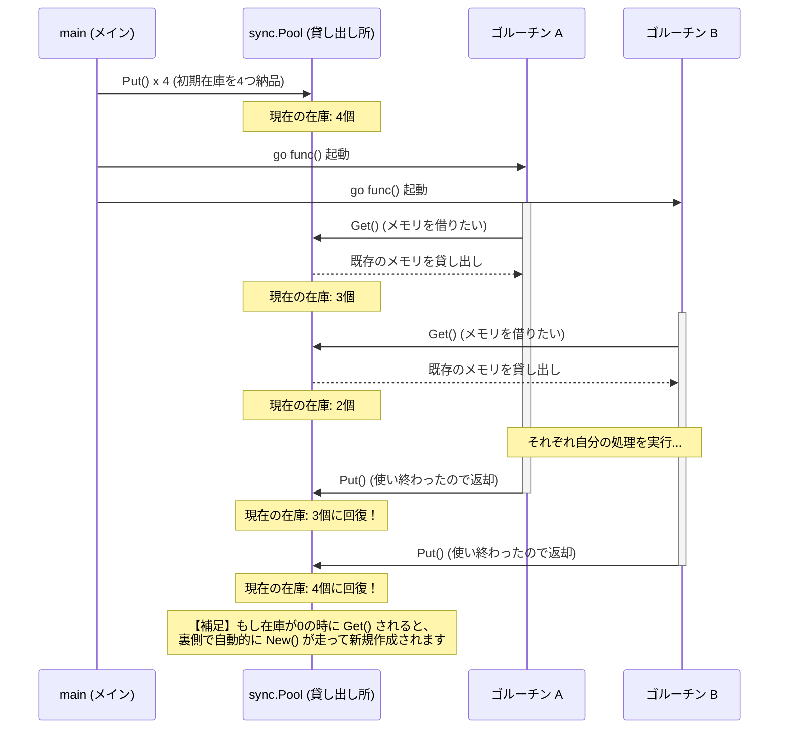
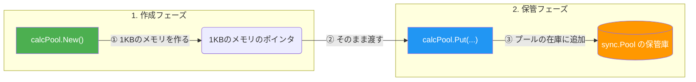

こんにちは！最近はGo言語の並行処理の奥深さにどっぷりハマっています😎
今回は、パフォーマンスチューニングの切り札とも言える **`sync.Pool`** について勉強したことをまとめてみました！

大量のデータを処理するプログラムを書いていると「メモリの確保」がボトルネックになることってありますよね。そんな時にめちゃくちゃ役立つのがこの `sync.Pool` です。

---

## 1. そもそも `sync.Pool` とは？💡
`sync.Pool` は、一言でいうと**「使い終わったデータを一時的に保管しておき、後で再利用（使い回し）できるようにする貸し出し所（プール）」**です。

### なぜ使うの？（解決する課題）
Go言語には不要になったメモリを自動で掃除する機能（ガベージコレクション = GC）があります。
しかし、「100万個のゴルーチンが毎回新しくメモリを確保しては捨てる」ような処理を行うと、メモリの確保とGCによるお掃除が頻発し、プログラムの動作が非常に重くなってしまいます。

そこで `sync.Pool` の出番です！**「一度確保したメモリをみんなで使い回す」** ことで、新規確保とGCの負荷を劇的に減らし、パフォーマンスを爆上げさせることができます🔥

---

## 2. 実装例：100万個のゴルーチンを回してみる
百聞は一見に如かずということで、100万個のゴルーチンがそれぞれ1KBのメモリ空間を必要とするベンチマーク的なコードを書いてみました。

```go
package main

import (
	"fmt"
	"sync"
)

func main() {
	var numCalcsCreated int
	
	// 1. Poolの作成
	calcPool := &sync.Pool{
		// プールの中身（在庫）が空っぽの時に呼ばれる作成ルール
		New: func() interface{} {
			numCalcsCreated++         // 新規作成された回数をカウント
			mem := make([]byte, 1024) // 1KBのメモリを確保
			return &mem               // ポインタを返す
		},
	}

	// 2. 在庫の事前準備（シード）
	// あらかじめ4つのメモリを作ってプールに入れておく
	calcPool.Put(calcPool.New())
	calcPool.Put(calcPool.New())
	calcPool.Put(calcPool.New())
	calcPool.Put(calcPool.New())

	// 3. 約100万個のゴルーチンを一気に起動！
	const numWorkders = 1024 * 1024
	var wg sync.WaitGroup
	wg.Add(numWorkders)
	
	for i := numWorkders; i > 0; i-- {
		go func() {
			defer wg.Done()
			
			// プールから1つ借りる（在庫がなければ自動で New() が呼ばれる）
			mem := calcPool.Get().(*[]byte)
			
			// 処理が終わったら捨てるのではなく、プールに返却する
			defer calcPool.Put(mem)
		}()
	}

	wg.Wait()
	
	// 最終的にメモリが「新しく作られた回数」を出力
	fmt.Printf("%d calculators were created.", numCalcsCreated)
}
```

### 処理の流れを図解してみました🎨
ゴルーチンたちがどのようにプールからメモリを借りて、返却しているかのイメージです。



---

## 3. このコードの凄さと注意点⚠️

### 驚愕の実行結果
このプログラムを実行して出力される `numCalcsCreated`（新規に作られた回数）は、なんと**「4回（初期に作った4つ分）」**か、増えても数十回程度にとどまります！

100万回もの処理がほぼ同時に走ったにも関わらず、ゴルーチンたちが物凄いスピードで `Put`（返却）と `Get`（貸出）を繰り返し、ごく少数のメモリをうまく全員で使い回しているんです。めっちゃエコですよね🌿

### 使う時の注意点
すごく便利な `sync.Pool` ですが、1つだけ気をつけるべき罠があります。
中に保管されているデータは、**Goのガベージコレクションが走るタイミングで予告なく勝手に消去される**仕様になっています。

そのため、「絶対に消えてほしくないデータベースの接続情報」などの保存には使えません！あくまで「消えてもまた作ればいいけど、再利用できたらラッキー」という一時的なキャッシュとして使いましょう。

---

## 4. 文法に関するQ&A（初心者向けTips）🐣
最後に、コードを読んでいて「ん？」となりやすい文法事項をQ&A形式でまとめておきます！

### Q1. `sync.Pool` の `New` って何？
**A.** プール自身は「どんなデータを預かっているか」を知りません。なので、在庫が空になったときに「どうやって新しいデータを作ればいいか」という作成手順を `New` にセットして教えてあげています。

### Q2. `func() interface{}` の `interface{}` って？
**A.** Go言語の型宣言ですね。`sync.Pool` はどんなデータでも入れられるように、戻り値の型として「なんでも入る魔法の箱」である `interface{}` を要求しています。省略はできません！

### Q3. `calcPool.Put(calcPool.New())` はどういう処理？
**A.** カッコの内側から先に実行されるルールを利用して、作成と保管を1行で書くテクニックです！



### Q4. なぜ `&sync.Pool{}` と `&`（ポインタ）をつけるの？
**A.** たった1つの貸し出し所を作り、全員でそれを共有するためです。ポインタにしないと、ゴルーチンごとに別々のプール（パラレルワールド）が作られてしまい、在庫の共有ができなくなってしまいます。

### Q5. `calcPool.Get().(*[]byte)` の `.(*[]byte)` って何？
**A.** 「型アサーション」と呼ばれる呪文です。プールの `Get()` は戻り値を `interface{}`（中身が不明な箱）で返してくるので、「この箱の中身は『バイト配列のポインタ（`*[]byte`）』ですよね！」とGo言語に教えてあげて、元のデータとして取り出しています。

---

## まとめ
並行処理におけるメモリ確保の負荷を大幅に削減できる `sync.Pool`。
使い所を見極めれば、システムのパフォーマンスを劇的に改善できる強力な武器になりそうです！💪

以上、今日の学習メモでした！
